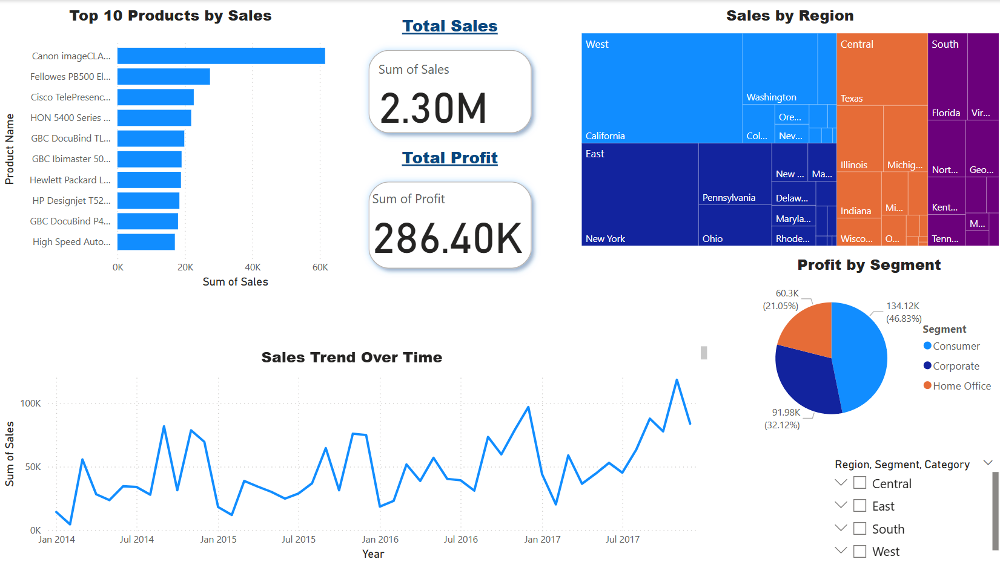

# 🧠 Executive Summary

This interactive **Sales Performance Dashboard** was developed using Power BI to analyze sales, profit, product trends, customer segments, and regional performance using the Superstore dataset. The goal was to deliver business insights that support data-driven decision-making in a retail context.

### 🔍 Key Insights:
- 💰 **Total Sales** reached approximately **$2.3M**, with **$286.4K** in **Total Profit**, highlighting overall profitability trends.
- 🏆 **Canon imageCLASS** topped the **Top 10 Products by Sales**, indicating a concentration of revenue among a few key SKUs.
- 🌎 **Sales by Region** showed **dominance in the West and East**, especially in California, New York, and Washington.
- 📊 **Sales Trend Over Time** revealed consistent growth with seasonal peaks, especially strong in Q4 each year.
- 🧑‍💼 **Profit by Segment** indicated that:
  - The **Consumer segment** drove the highest profit (46.83%),
  - **Corporate** followed (32.12%),
  - While **Home Office** contributed least (21.05%).

### 🛠️ Tools Used:
- Power BI for dashboard creation and interactivity
- Excel for data cleaning and preprocessing

### 🎯 Business Value:
This dashboard allows stakeholders to:
- Identify top-performing products and regions
- Monitor profitability by segment
- Track trends over time for planning promotions and inventory

## 📸 Sales Performance Dashboard

